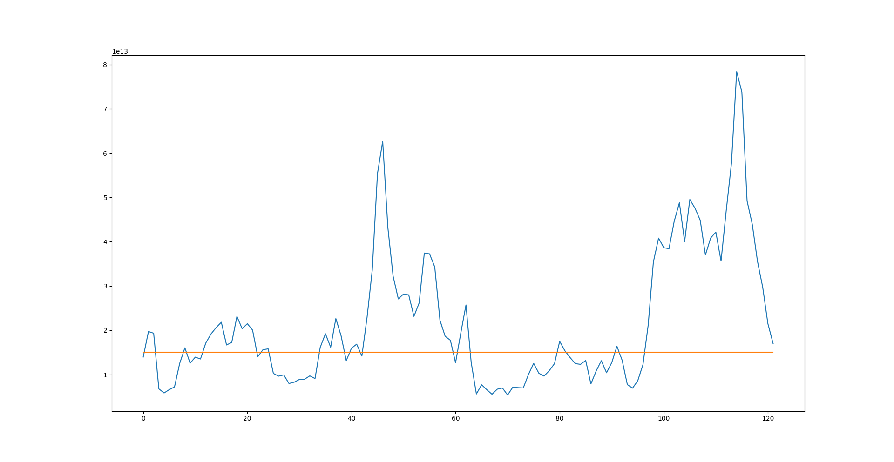
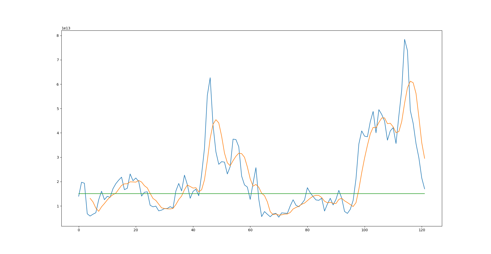
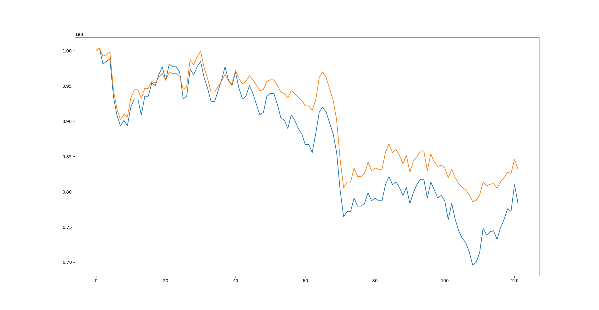

# Using Simple AutoEncoder as Anomaly Detection Algorithm

## Background
<p>
    Anomaly detection can play a serious role in financial system. 
    The model itself can provide whether the data is behaving like it always have been or not.
    However, traditional method in most Korean financial system - and certainly most widely used method due to its simplicity - 
    tends to assume the 2 sigma rules. 
</p>

### Old, Traditional method.
<p>
    "What is 2 sigma rules?" you might ask.
    In a normal distribution almost all observed data will fall within 3 standard deviation from the mean.
    Under this rule 68% of the data is included between the band of 1 standard deviation from the mean,
    and 95% of the data is included between the band of 2 standard deviation from the mean. 
    Consequently, when I say financial system uses 2 sigma rules, it is basically stating that:
    "Financial time series follows normal distribution"
</p>

<p>
    But no. It's been well proven that the financial time series doesn't exactly follows normal distribution.
    It is known that it has a tendency to show phenomenon such as volatility clustering. 
    Therefore, it exhibits much fatter tail than the normal distribution. 
    In this sense, it you still impose 2 sigma rules you rule out more observation as an "anomaly" than you actually think.
</p>

### PCA, AutoEncoder
<p>
    So is there a better and more elegant way to classify whether this observation is acting strange from others?
    Yes, in fact there's something called AutoEncoder. Well, there's PCA, too but in a certain sense they both work in a similar fashion.
    PCA projects dataset into a new coordinate system. 
    In process it puts some scalar projection of the data that has greatest variance(explained) first,
    and other projection that explains little of the variance at the back. 
</p>

```
import numpy as np
import pandas as pd

def gen_factor(X):    
    
```
<p>
    After observation, you can see that the factor loading in the first column shows the general trend or momentum.
    As you move down to the second column you can see that the momentum is gone and it is replaced by some wave like noises.
    If you use all of the matrix, or 100% or explained variance, you are effectively using all of the original data.
    However, it your objective is to reduce dimension, you can leave out the columns located at the far back.
    Leaving those columns out means that you are assuming dropping small noises and thereby increasing the chance of your data to be generalized and prevent any models from being overfitted
    - which is important thing in a data-oriented society. 
</p>


<p>
    AutoEncoder works somewhat similarly to PCA. In fact, a single layer AutoEncoder with linear activation function gives nearly identical results to that of PCA.
    However, AutoEncoder has much more potential, because while PCA is constrained in linear space, PCA can employ both linear and non-linear methods.
    Essentially AutoEncoder reduces the dimension of the data and then grow it back to the original size. 
    The input data and the output data are both feature data, so there's no need to have a target data - that's why it's called unsupervised learning. 
    In the process of finding the optimal betas for all of the non-linear or linear regression in the neural network system,
    the result of encoding layers becomes dataset that best explains the whole dataset.
</p>

<p>
    The typical shape of the AutoEncoder is presented all around the all mighty google,
    so I don't think there's a need to show pictures of the typical AutoEncoder 
</p>


## Implementation

### Finding anomaly. - Intuition
<p>
    So how can we use AutoEncoder as a way to find anomaly? This was the big question of this post wasn't it? 
    The intuition is simple: if one uses only normal data(normally acting data) to train the AutoEncoder and use the fitted model to predict
    dataset that has mixture of normal and abnormal data, the prediction error of abnormal data will be all over the place. 
    We can just set a threshold for prediction error and if it goes off the chart, we will define it as an anomaly. 
</p>

<p>
    For demonstration I will be using simple AutoEncoder. I messed around with the hidden layers and dropout rate, but not much else.
    To prevent the model from being overfitted, I used earlystop callback to stop the training process whenever the monitoring variable fails to improve.
    Also to monitor the whole process, I've utilized tensorboard callback.
</p>

```
import tensorflow as tf


def callbacks_tb(logging, name):
    tb = tf.keras.callbacks.TensorBoard(
        log_dir=f"{logging}{name}",
        histogram_freq=1
    ) 
    return tb

def callbacks_es(monitor_val, waitfor):
    es = tf.keras.callbacks.EarlyStopping(
        monitor=monitor_val,
        patience=waitfor
    )
    return es
```

<p>
    To see the TensorBoard dash, you simple write `tensorboard --logdir [logging]` on your command line.
</p>

<p>
    Now let us create a simple auto encoder. All the layer will have ReLU activation functions and 
    only the output layer will have linear activation functions
</p>

```
from tensorflow.keras.models import Sequential
from tensorflow.keras.layers import Dense, Activation, Dropout
import tensorflow as tf
import config as s  # Custom Configuration file.


def auto_encoder(init_inputdim:int):
    model = Sequential()
    # Encoding Layer
    model.add(
        Dense(
            s.AUTOENCODER_DENSE1, 
            input_dim=init_inputdim,
        )
    )
    model.add(
        Activation('relu')
    )
    model.add(
        Dropout(
            s.DROPOUT_DENSE1
        )
    )
    
    # Encoded Layer
    model.add(
        Dense(
            s.AUTOENCODER_DENSE2
        )
    )
    model.add(
        Activation('relu')
    )
    model.add(
        Dropout(
            s.DROPOUT_DENSE2)
        )
    )
    # Decoded Layer
    model.add(
        Dense(
            s.AUTOENCODER_DENSE3
        )
    )
    model.add(
        Activation('relu')
    )
    model.add(
        Dropout(
            s.DROPOUT_DENSE3
        )
    )
    
    # Result Layer
    model.add(
        Dense(
            init_inputdim  # Input dimension and output dimension should be the same
        )
    )
    model.add(
        Activation('linear')
    )
    
    model.compile(
        optimizer='adam',
        loss='mse'
    )
    
    return model            
```

<p>
    I used this simple model to predict a massive short selling that could potentially bring down the price of a
    single stock. In South Korea, only the institution can short that stocks, and the only means of doing it is by borrowing the stocks.
    Not all borrowed stocks are used for shorts though - or else it would be pretty obvious. 
    However, from March 2020 to April 2021, South Korean government briefly disabled short selling mechanism
    in order to <em>'protect the market from falling'</em>. Pretty dumb right? 
    Anyway, because there was more than a year of period that is relatively recent, and no short selling occurred,
    I thought we can safely assume that lended stocks from that periods were only used for "other purposes".
</p>

<p>
    Therefore, I trained the model with the data derived specifically from that period. 
    Data were daily stock price of individual stocks, and the example given below is based on SK Hynix stock price.
    The feature set only included up-to-20-days lag(AR1 ~ AR20) of the daily stock price. 
    After the training, I inserted the periods after May 2021, and checked the prediction errors. 
</p>



<p>
    The orange line illustrates the signal threshold I've set. To mitigate the signal changing so rapidly, 
    just a simple smoothing process with the moving average will do prevent us from changing portfolios too quickly.
    It lags slightly behind the original signal(blue line) but, it'll do the trick just fine.
</p>



<p>
    To test the theory, I've created a Dummy-Portfolio. It only consists of 1 stocks and it only has 2 states.
    First state utilizes 100% of its cash to buy stocks. The other state utilizes only 50% of its cash to buy stock and puts the 
    remaining cash in the vault. And then I put it in a Backtesting class method I made and compared it with the control group. 
    The control portfolio never changed its state from the first state, while the experimental portfolio switched to state 2 whenever
    the danger signal arises.
</p>

```
import pandas as pd
import numpy as np
from typing import Iterable


class SimplePortfolio:
    t = 0
    stock_cnt = 0
    colname = (
        'period', past_cash', 'present_cash', 'past_risk',
        'present_risk', 'stock_amount',
    )
    
    def __init__(self, risk_prc:float, state:str='normal', risk_allo:float=1.0, init_cap=10**8):
        self.log = list()
        self.state = state
        self.prc = risk_prc
        self.money = init_cap
        self.risk_ratio, self.cash_ratio = (
            risk_allo, 1 - risk-allo
        )
        self.stock_cnt = (init_cap * risk_allo) // risk_prc
        if self.stock_cnt == 0:
            raise RuntimeError("Increase init_cap")
        self.cash = init_cap - self.stock_cnt * risk_prc
        
        # Log Initial States
        self.logger(
            past_risk=np.NAN,
            past_cash=np.NAN,
            present_risk=self.stock_cnt * risk_prc,
            present_cash=self.cash,
            stock_count=self.stock_cnt
        )
    
    def __repr__(self):
        msg = f"NAV {self.money}. Stock {self.stock_cnt}
        return msg
        
    def state_change(self, newval):
        if self.state == 'normal':
            chkpoint1 = self.cash + self.stock_cnt * newval
            
            self.state = 'abnormal'
            self.risk_ratio = 0.5
            reduce = self.stock_cnt // 2
            
            self.cash - self.cash + reduce * newval
            self.stock_cnt = self.stock_cnt - reduce
            chkpoint2 = self.cash + self.stock_cnt * newval
            assert chkpoint1 == chkpoint2
        else:
            chk1point = self.cash + self.stock_cnt * newval
            self.state = 'normal'
            self.risk_ratio = 1
            
            increase = self.cash // newval
            self.cash = self.cash - newval * increase
            self.stock_cnt = self.stock_cnt + increase
            chkpoint2 = self.cash + self.stock_cnt * newval
            assert chkpoint1 == chkpoint2
            
    def report_flow(self) -> pd.DataFrame:
        s = pd.DataFrame(
            self.log,
            columns=self.colname
        )
        s['NAV'] = s.present_cash + s.present_risk
        if s.empty:
            return None
        else:
            return s
            
    def risk_profit(self, new_val:float, incoming_state):
        if incoming_state == self.state:
            # Cash
            past_cash = self.cash
            new_cash = self.cash
            
            # Risk
            past_risk = self.stock_cnt * self.prc
            new_risk = self.stock_cnt * new_val
            
            # Log
            self.logger(
                past_cash=past_cash,
                past_risk=past_risk,
                present_cash=new_cash,
                present_risk=new_risk,
                stock_count=self.stock_cnt
            )
        else:
            past_cash = self.cash
            past_risk = self.stock_cnt * self.prc
            
            self.state_change(newval=new_val)
            new_cash = self.cash
            new_risk = self.stock_cnt * new_val
            
            self.logger(
                past_cash=past_cash,
                past_risk=past_risk,
                present_cash=new_cash,
                present_risk=new_risk,
                stock_count=self.stock_cnt
            )
        self.money = new_cash + new_risk
        self.prc = new_val
    
    def logger(self, past_cash:float, past_risk:float, present_cash:float, present_risk:float, stock_count:int):
        self.log.append(
            (self.t,
             past_cash,
             present_cash,
             past_risk,
             present_risk,
             stock_count)
        )
        self.t += 1
        

class BackTest:
    def __init__(self, anomaly_signal:Iterable, price_info:Iterable, ctrl_portfolio:SimplePortfolio, exp_portfolio:SimplePortfolio):
        self.signal = anomaly_signal
        self.prclist = price_info
        self.control = ctrl_portfolio
        self.experiment = exp_portfolio
    
    def run(self):
        for signal, price in zip(self.signal[1:], self.prclist[1:]):
            self.control.risk_profit(
                new_val=price,
                incoming_state='normal'
            )
            self.experiment.risk_profit(
                new_val=price,
                incoming_state=signal
            )
```

<p>
Each Portfolio started with 100,000,000 KRW in their NAV. 
Since the control portfolio would never change its ~100% weight on stocks, it will follow the path of the stock itself.
Also I assumed(rather unrealistically) there were no additional returns on the cash itself. (In real life, you can buy bonds or whatever)
These are the result:
</p>

## Result



<p>
Orange line represents the experimental portfolio while the blue one represents the control group.
It both fail to keep the original 10,000,000 NAV, but as you can clearly see over the course of 5 months
the experimental group that acts according to the signal was able to beat the control group in downward market,
while giving same result when the market is moving sideways or slightly upwards.
</p>

<p>
Not only the experiment proves that anomaly detection in stock lending actually works, 
but it gives an additional insight to the market. After this I will try to convert the model into 
RNN using AutoEncoder, and see that if that can beat the benchmark.  
</p>


