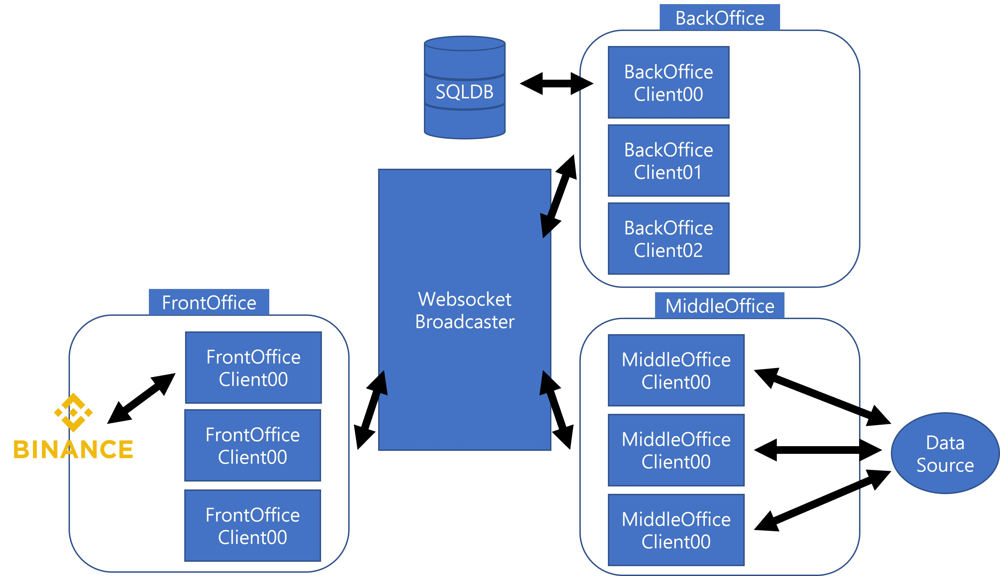

# Project Inter-Market Crypto Trading Bot
<p>
    파이썬으로는 구현한지 오래 되었지만, 이번에 백엔드를 Golang으로 바꿔보고, Golang을 사용하는 과정을
    기록하고자 다음 포스팅을 시작해본다. 
   참고로, 이번 포스팅에서는 (몇 개가 될진 모르겠지만), 거래 전략은 공개하지 않을 것이므로, 
이런 것들이 필요하다면 다른 사이트들을 조사해보는게 어떨까 싶다.  
</p>

## 1 Trader - 1 Signal Bot
<p>
    처음 만든 트레이딩 봇은 전략 하나당 하나의 트레이더가 붙는 방식으로 제작되었다.
    예컨대, 머신 러닝을 통한 모멘텀 전략을 사용했다면 다음과 같은 스크립트가 하나의 거래전략을 완성하였다.
</p>

```
import TradingClass
import StrategyClass

t = TradingClass(*args, **kwargs)
s = StrategyClass(*args, **kwargs)

while True:
    if s.signal():
        # If signal is given t class execute trade(trade())
        t.trade()
```

## K Signal Bots - 1 Database - 1 Trader

<p>
    하지만 다음과 같은 봇은 전략을 많이 사용하는 만큼 StrategyClass를 조절 혹은 
    추가로 제작해야하는 단점이 존재한다. 때문에, 다음 프로젝트는 
    중앙에 데이터베이스가 있고, StrategyClass가 중앙 데이터베이스에 통일된 형식의 신호와 거래 정보를 넣으면,
    데이터베이스를 계속 조회하고 있는 TradingClass가 신호가 들어오는 즉시 거래를 실시하는 방식으로 
    제작하였다. Pseudo 코드 구조는 다음과 같을 것이다. 
</p>


```
signal.py ->

import StrategyClass0
import StrategyClass1

s0 = StrategyClass0()
s1 = StrategyClass1()

# Using ThreadPool
s0.record_signal()
s1.record_signal()
```

```
trader.py ->

import TradingClass
import DBM

from datetime import datetime, timedelta

def check_signal(t:TradingClass):
    # Query Database for Signal
    # Everytime you query, DB locks down.
    # sqlite provides pragma journal_mode = WAL. Use that
    # WAL: Write-Ahead Logging. 
    
    d = dbms.select_db(*args, **kwargs)
    t = datetime.now()
    
    if not d.loc[d['time'] > t - timedelta(seconds=5)].empty:
        # Signal generated within 5 seconds
        print("Trade executed")
        t.trade()
        
t = TradingClass()
check_signal(t)
```
<p>
    다시말하지만, 위는 모두 pseudo 코드로서 이런 식으로 코드를 짰다는 것은 아니지만, 이런식으로 짜져있었다.
    하지만 뻔히 보이는 단점이 존재하는데, 

1. 데이터베이스를 신호가 나오지 않더라도 일정시간 기준으로 계속 조회하는 과정에서 리소스 낭비가 일어남.
2. Real-Time으로 받는 것이 아니라 최소한 2번의 과정에서 Signal Lag가 발생
   1. 신호를 기록하는 과정에서 Lag 발생
   2. 신호를 데이터베이스에서 받아오는 과정에서 Lag 발생
   3. 만약 trading window가 매우 짧다면, 다음 Lag는 치명적임.

</p>

## K Signal Bots & K Traders <=> Websocket Backend

<p>
마지막으로 작업물은 데이터베이스를 계속 쿼리하는 것이 아니라,  
웹소켓을 이용하여 시그널(Event)가 발생할때 웹소켓 구독자들(참여자들)에게 메시지를 전송하고,
구독자들 중 자신에게 해당하는 메시지가 있으면 그에 대한 대응을 하는 방식이다. 
앞선 두 방식에서 나타나는 문제점(확장성, 비동시성)을 해결하는 방식이다. 
모든 봇(Signal and Trader)들은 다른 스크립트에서 독립적으로 실행되며, 
GIL Lock 때문에 진정한 MultiThreading을 보장하지 않는 Python에서
Multiprocessing을 통한 진정한 동시성을 확보할 수 있을것이라 생각되었다. 
이미 구현된 구조는 다음과 같다. 
</p>



<p>
Python3로 이미 구현은 완료하였으나, Golang이란 Compile 언어를 통해, 안정성과 프로세스 속도
그리고 완전한 동시성을 구현하고자 백엔드 및 할 수 있는 곳까지 다시 짜보고자 한다. 
또한 Python Client들(Signal Bots와 Traders)도 수정을 가하는 곳이 있으면 수정을 가할 것이다. 
</p>

